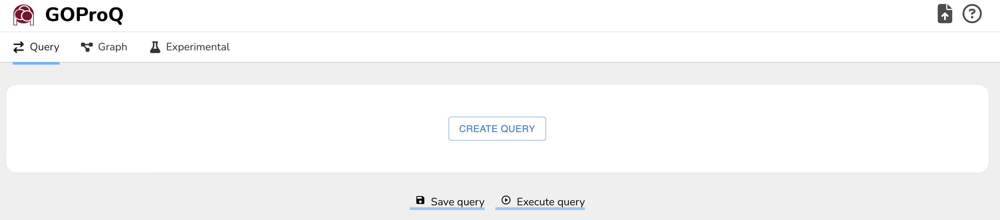

# GOProQ: Graphical Object-centric Process Querying

[](https://www.docker.com/)
[](https://python.org/)
[](https://reactjs.org/)
[](https://fastapi.tiangolo.com/)

## 🎯 Overview

**GOProQ** is a cutting-edge graphical query language designed for querying Object-Centric Event Logs (OCELs). It provides an intuitive visual interface for constructing complex queries that analyze process executions across multiple object types, enabling powerful insights into object-centric business processes.

### ✨ Key Features

- **🎨 Visual Query Builder**: Drag-and-drop interface for constructing complex queries
- **📊 Real-time Visualization**: Interactive graphs and process execution views
- **🔍 Advanced Query Engine**: Support for activity, object type, and control-flow queries
- **📈 Performance Analytics**: Comprehensive metrics and statistics
- **🐳 Docker Ready**: Complete containerization for easy deployment
- **🌐 Modern Web Interface**: Responsive design with Material-UI components

  
*GOProQ's Modern Web Interface*

---
## 🚀 Quick Start with Docker

The fastest way to get GOProQ running is with Docker:

### Production Mode
```bash
# Clone the repository
git clone <repository-url>
cd GOProQ

# Start the application
./docker-start.sh production
# or
make start-prod

# Access the application
# Frontend: http://localhost
# Backend API: http://localhost:8080
```

### Development Mode
```bash
# Start with hot reload
./docker-start.sh development
# or
make start-dev

# Access the application
# Frontend: http://localhost:3000 (with hot reload)
# Backend API: http://localhost:8080 (with auto-reload)
```

---

## 🏗️ Manual Installation

### Prerequisites
- **Python 3.10+** (for backend)
- **Node.js 18+** (for frontend)
- **Docker & Docker Compose** (optional, for containerized deployment)

### Backend Setup

1. **Navigate to backend directory**
   ```bash
   cd backend/
   ```

2. **Create and activate virtual environment**
   ```bash
   python -m venv venv
   source venv/bin/activate  # On Windows: venv\Scripts\activate
   ```

3. **Install dependencies**
   ```bash
   pip install -r requirements.txt
   pip install ocpa==1.3.4
   ```

4. **Start the FastAPI server**
   ```bash
   export MPLBACKEND=Agg  # Set matplotlib backend
   python -m uvicorn src.main:app --host 0.0.0.0 --port 8080 --reload
   ```

### Frontend Setup

1. **Navigate to frontend directory**
   ```bash
   cd frontend/
   ```

2. **Install dependencies**
   ```bash
   npm ci
   ```

3. **Start the development server**
   ```bash
   npm start
   ```

4. **Access the application**
   - Open [http://localhost:3000](http://localhost:3000) in your browser

---

## 🎮 Application Features

### 1. **Data Lens** 📊
- **Process Execution Overview**: View all process executions with key metrics
- **Performance Analytics**: Duration, event counts, object statistics
- **Interactive Visualization**: Click to view detailed process execution graphs
- **Real-time Data**: Live updates from your OCEL data

### 2. **Query System** 🔍
- **Visual Query Builder**: Drag-and-drop interface for creating queries
- **Query Types**:
  - **Activity Queries**: Target specific service activities with constraints
  - **Object Type Queries**: Check existence and cardinality of object types
  - **Control-Flow Queries**: Capture temporal relationships between activities
  - **Logical Composition**: Combine queries with AND, OR, NOT operators
- **Query Management**: Save, edit, and execute queries
- **Real-time Results**: Instant feedback on query performance

### 3. **Advanced Query Features** ⚡
- **Nested Queries**: Support for complex hierarchical query structures
- **"ANY" Object Type**: Flexible object type matching
- **Temporal Constraints**: Directly-follows and eventually-follows relationships
- **Cardinality Constraints**: Precise control over object and activity counts

### 4. **Data Management** 📁
- **OCEL Support**: Native support for JSONOCEL and XMLOCEL formats
- **File Upload**: Easy data import through web interface
- **Metadata Extraction**: Automatic discovery of activities and object types
- **Data Validation**: Built-in validation for OCEL format compliance

---

## 🐳 Docker Deployment

### Production Deployment

```bash
# Build and start production services
docker-compose -f docker-compose.production.yml up --build -d

# Check service status
docker-compose -f docker-compose.production.yml ps

# View logs
docker-compose -f docker-compose.production.yml logs -f
```

### Development Deployment

```bash
# Build and start development services with hot reload
docker-compose -f docker-compose.development.yml up --build -d

# View logs
docker-compose -f docker-compose.development.yml logs -f
```

### Docker Management Commands

```bash
# Start services
./docker-start.sh [production|development]

# Stop services
./docker-stop.sh [production|development]

# View logs
./docker-logs.sh [production|development] [service]

# Using Makefile
make start-prod    # Start production
make start-dev     # Start development
make stop-prod     # Stop production
make logs-prod     # View production logs
make status-prod   # Check service status
```

---

## 📋 API Documentation

The backend provides a comprehensive REST API:

- **API Documentation**: http://localhost:8080/docs (Swagger UI)
- **Available Logs**: `GET /logs/available`
- **OCEL Metadata**: `PUT /pq/ocel_metadata`
- **Query Execution**: `PUT /pq/goproq_query`
- **Process Execution**: `GET /pq/get_process_execution`

### Example API Usage

```bash
# Get available OCEL files
curl http://localhost:8080/logs/available

# Get OCEL metadata
curl -X PUT http://localhost:8080/pq/ocel_metadata \
  -H "Content-Type: application/json" \
  -d '{"file_path": "data/order_fulfillment.jsonocel"}'
```

---

## 🔧 Configuration

### Environment Variables

**Backend:**
- `MPLBACKEND=Agg`: Sets matplotlib backend (required for headless operation)
- `PYTHONUNBUFFERED=1`: Ensures Python output is sent to terminal
- `DEVELOPMENT_MODE=true`: Enables development features

**Frontend:**
- `REACT_APP_API_URL`: Backend API URL (default: http://localhost:8080)
- `NODE_ENV`: Node environment (production/development)

### Docker Volumes

- `backend_data`: Stores OCEL files and uploaded data
- `backend_cache`: Caches processed data for performance
- `backend_logs`: Application logs

---

## 🛠️ Troubleshooting

### Common Issues

1. **Backend won't start**
   - Ensure `MPLBACKEND=Agg` is set
   - Check if port 8080 is available
   - Verify Python dependencies are installed

2. **Frontend connection issues**
   - Verify `REACT_APP_API_URL` is correct
   - Check if backend is running on port 8080
   - Clear browser cache

3. **Docker issues**
   - Ensure Docker daemon is running
   - Check available disk space
   - Verify Docker Compose version (2.0+)

4. **Matplotlib errors**
   - Set `MPLBACKEND=Agg` environment variable
   - Ensure running in headless environment

### Getting Help

- Check the logs: `docker-compose logs [service]`
- Verify service health: `docker-compose ps`
- Review API documentation: http://localhost:8080/docs

---

## 📚 Technical Details

### Architecture
- **Backend**: FastAPI with Python 3.10+
- **Frontend**: React 18+ with TypeScript
- **Database**: In-memory processing with OCEL data
- **Visualization**: Cytoscape.js for graph rendering
- **Query Engine**: Custom GOProQ query processor

### Supported Formats
- **OCEL**: JSONOCEL, XMLOCEL
- **Data**: Process execution graphs, event logs
- **Export**: JSON, CSV (via API)

### Performance
- **Query Optimization**: Intelligent query reordering
- **Caching**: Built-in result caching
- **Scalability**: Docker-based horizontal scaling support

---

## 🤝 Contributing

1. Fork the repository
2. Create a feature branch
3. Make your changes
4. Add tests if applicable
5. Submit a pull request

---

## 📄 License

This project is licensed under the MIT License - see the LICENSE file for details.

---

## 🙏 Acknowledgments

- **OCPA Library**: For object-centric process analysis capabilities
- **FastAPI**: For the robust backend framework
- **React**: For the modern frontend framework
- **Cytoscape.js**: For graph visualization capabilities

---

## 📞 Support

For issues, questions, or contributions:
- Create an issue in the repository
- Check the troubleshooting section above
- Review the API documentation at http://localhost:8080/docs

---

*GOProQ - Empowering Object-Centric Process Analysis through Visual Querying* 🚀