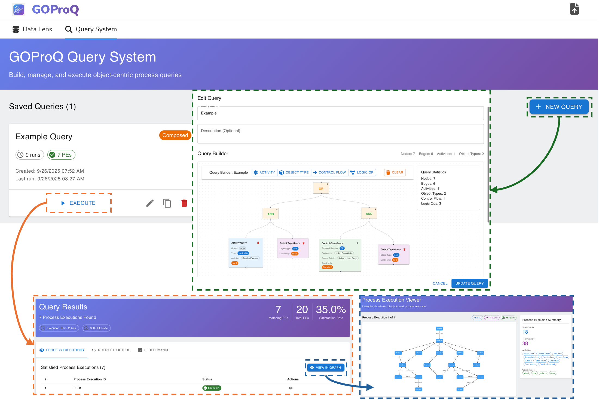

# GOProQ: Graphical Object-centric Process Querying

## Overview

GOProQ is a powerful tool designed to support a graphical query language tailored for querying graph-structured data in Object-Centric Event Logs (OCELs). It allows users to interactively query **process executions**, focusing on the interactions of multiple object types within object-centric processes. 

With its intuitive graphical interface and robust querying engine, GOProQ empowers users to:
- **Design queries visually** in an interactive manner.
- **Execute queries** using an advanced query engine.
- **Visualize query results** in real-time.

  
*Starting Page of GOProQ*

---

## Deployment Guide

Follow the steps below to deploy and run GOProQ. Ensure you meet the requirements for both backend and frontend environments.

### Backend Deployment

#### 0. Requirements
- Python >= 3.10.

#### 1. Installing Dependencies
- `cd backend/`
- Create a new virtual environment: `python -m venv ./venv`
- Activate said environment
  - Windows: `venv\Scripts\activate.bat` (or `activate.ps1` for powershell)
  - Most Linux shells: `source venv/bin/activate`
- Install dependencies: `pip install -r requirements.txt`

#### 2. Running the FastAPI Server
- `cd backend/`
- Start the backend server: `PYTHONPATH="src/" uvicorn main:app --host 0.0.0.0 --port 8080`

---

### Frontend Deployment

#### 0. Requirements
- Node.js (latest LTS version recommended).

#### 1. Installing Dependencies
- `cd frontend/`
- Install dependencies: `npm ci`.

#### 2. Running the Web Server
- `cd frontend/`
- Start the frontend server: `npm run start`
3. Open your browser and go to [http://localhost:3000](http://localhost:3000) to access the application.

---

## Notes and Troubleshooting
- Ensure no other application is using port **8080** (backend) or **3000** (frontend).
- For issues related to Python dependencies, try using an isolated Python environment (e.g., Conda).
- Always use the `npm ci` command for installing frontend dependencies to ensure exact versions.

---

### Happy Querying with GOProQ! 🎉
Let me know via gyunam.park@fit.fraunhofer.de if you’d like to enhance this tool further with additional features!